# 📱 Islami App

A Flutter-based Islamic mobile application providing Quran reading, Azkar (supplications), and radio streaming functionality.

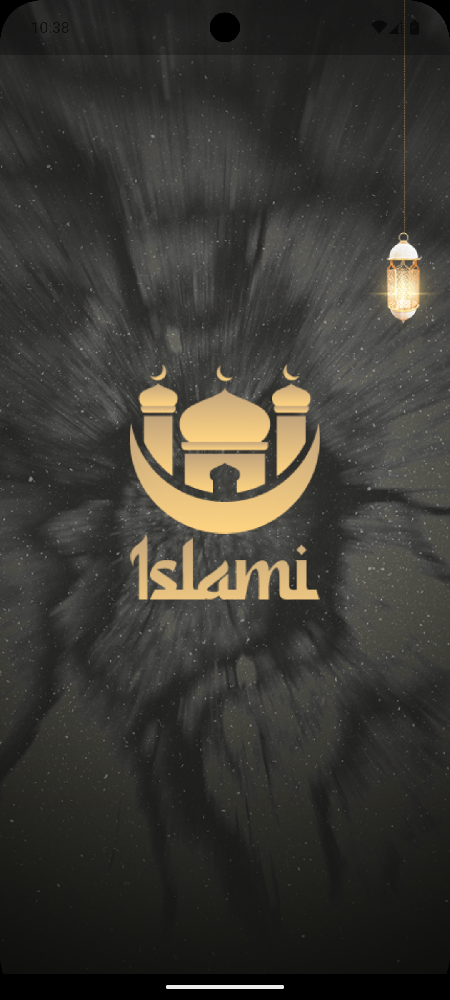

## 📖 Overview
Islami is a comprehensive Islamic mobile application built with Flutter. It includes:

- 📘 Quran Reading
- 🤲 Azkar (Islamic Supplications)
- 📻 Radio Streaming

The app follows **Clean Architecture**, uses **BLoC**, **Firebase Auth**, **Hive for local storage**, and **Dio for API handling**.

---

## 🧱 Architecture & Core Features

### 📂 Entry Point
- `main.dart` initializes Firebase, Hive, and the service locator before running the app.

### 🧭 Navigation
| Route | View |
|-------|------|
| `/` | SplashView |
| `/onBoarding` | OnboardingView |
| `/login` | LoginView |
| `/register` | RegisterView |
| `/main` | MainView (with Bottom Navigation) |
| `/surahDetails` | SurahDetailsView |
| `/azkarDetails` | AzkarDetailsView |

---

## 🧩 Features

| Feature | Description | Implementation |
|--------|-------------|----------------|
| 📖 Quran Reading | Browse & read Surahs | `HomeView`, `SurahDetailsView` |
| 🤲 Azkar | Access categorized supplications | `AzkarView`, `AzkarDetailsView` |
| 📻 Radio | Stream Quran/Islamic radio | `RadioView` |

---

## 🛠️ Core Technology Stack

- 🧠 State Management: `flutter_bloc`
- 🔐 Authentication: `firebase_auth`, `firebase_core`
- 💾 Local Storage: `hive`, `hive_flutter`
- 🔊 Audio Streaming: `just_audio`
- 🌐 Network Requests: `dio`
- 🧩 Dependency Injection: `get_it`
- 🔀 Routing: `go_router`
- ✅ Functional Programming: `dartz`

---

## 📦 Hive Boxes

| Box Name | Entity | Description |
|----------|--------|-------------|
| `kSurahsBox` | `SurahEntity` | Quran chapters |
| `kSurahDetailsBox` | `SurahDetailsEntity` | Surah info |
| `kAyahBox` | `AyahEntity` | Quran verses |
| `kAzkarBox` | `AzkarDetailsEntity` | Azkar content |

---

## 🧠 State Management & Clean Architecture

- **Presentation Layer:** Views, BLoC (Cubit)
- **Domain Layer:** Entities, UseCases, Repos (abstract)
- **Data Layer:** Local & Remote DataSources, Hive, Dio

## 📸 Screenshots

| Splash | OnBoarding | Login | Home | Azkar | Surah Details | Azkar Details | Radio |
|--------|------------|-------|------|-------|----------------|----------------|--------|
| 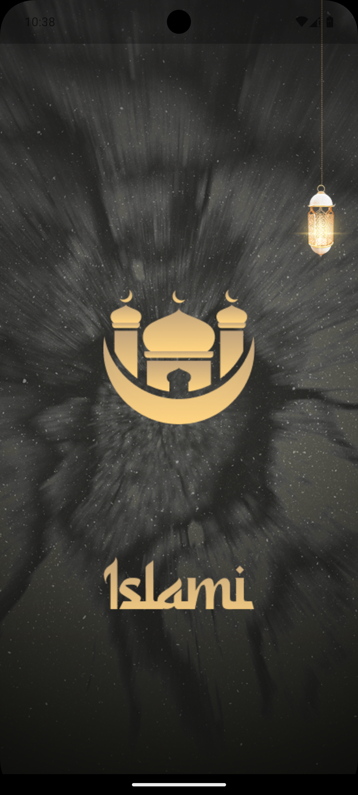    | 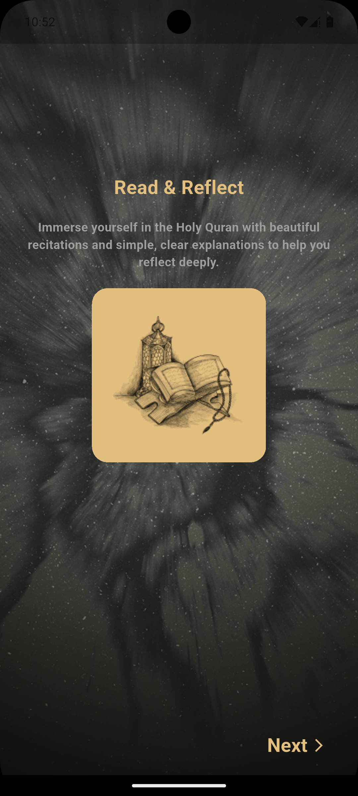   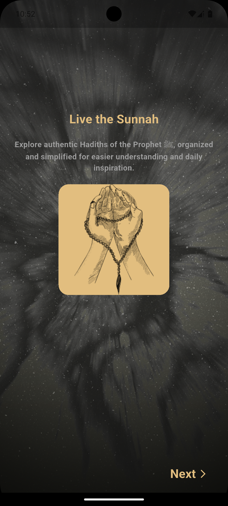   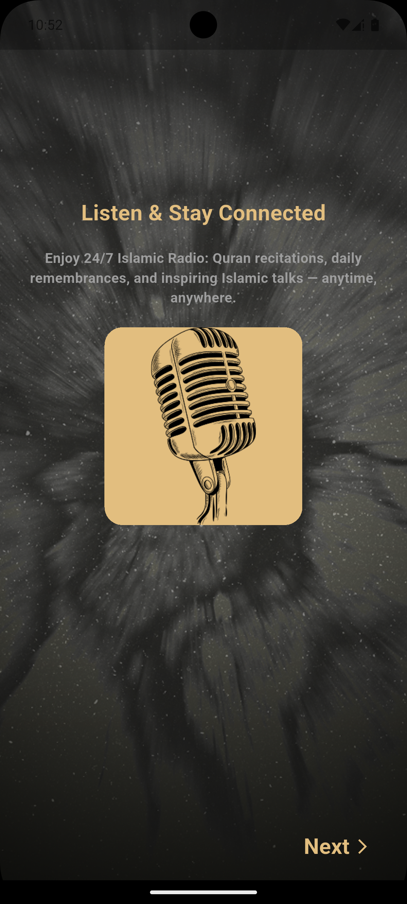 | 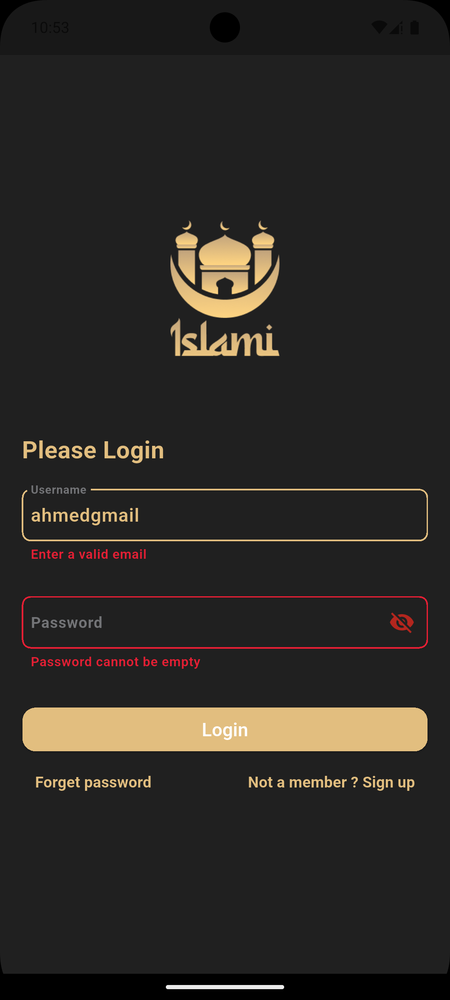 | 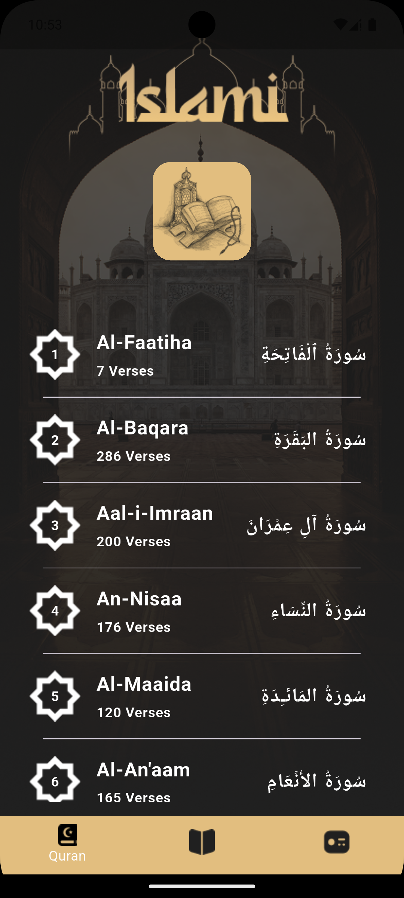 | 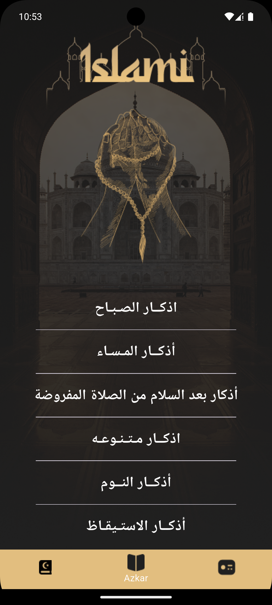 | 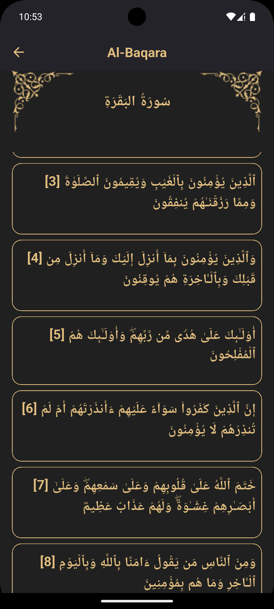 | 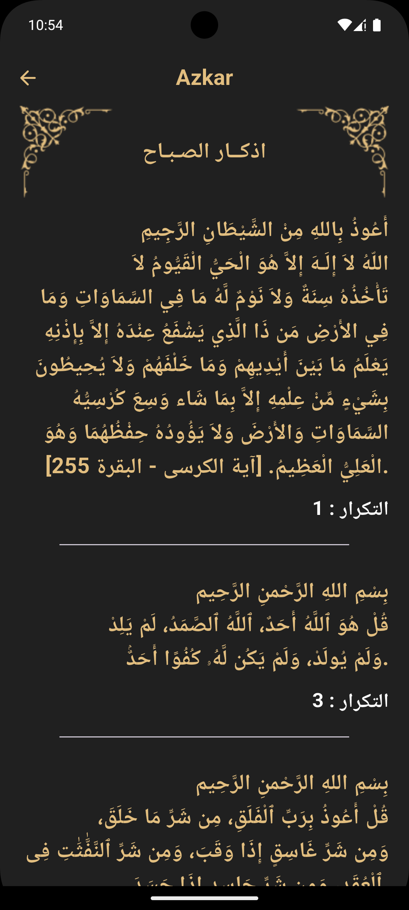 | 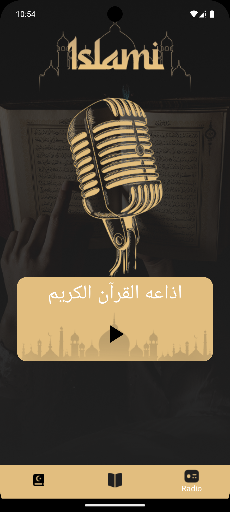 |

